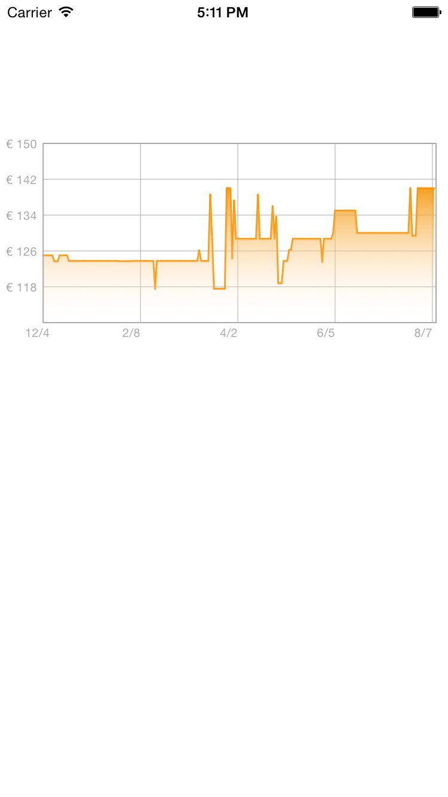

# zfPlotChart
_Simple class to draw a line graph based on a JSON file, written in Objective-C_

This class is used in PriceRadar, the app I wrote to track prices on Amazon, available here: https://itunes.apple.com/it/app/priceradar-seguiprezzo-per/id790926556?mt=8

Feel free to use this class, let me know if you find some bugs!

## Preview Image

